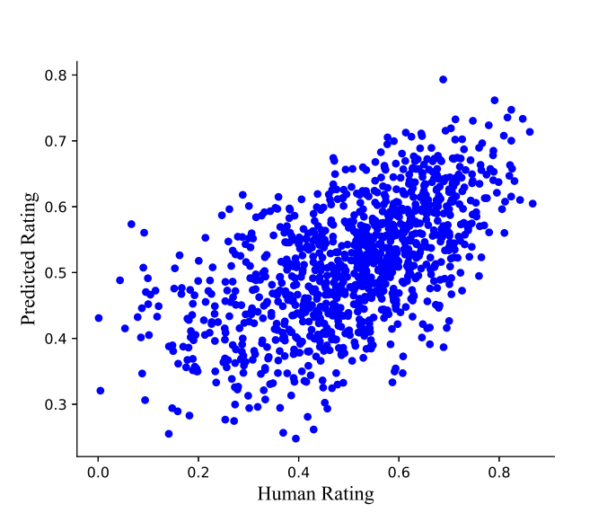

# Artistic Image Aesthetic Assessment

This repository contains the implementation of our convolutional neural network (CNN) model for the automatic aesthetic assessment of artistic images. Unlike traditional models that primarily rely on large-scale photography datasets, our approach focuses on the unique challenges posed by artistic images, which are more complex, diverse, and abstract.

## Dataset

We use a large-scale dataset of artistic images for aesthetic assessment, which consists of over 7,000 artistic images. Each image in the dataset is accompanied by an average aesthetic score assigned by users.

## Results



The comparison results between the predicted scores by our network and the true user ratings for all images in the testing set. The predicted scores closely align with the true user ratings.

## Getting Started

To get started with our model, follow the instructions below:

1. Train the network:
    ```bash
    python train.py
    ```
2. Evaluate a test image:
    ```bash
    python train.py --generate True
    ```

## Contributing

We welcome contributions to enhance the capabilities and performance of our aesthetic assessment model. Please fork the repository and submit pull requests.

## License

This project is licensed under the MIT License - see the [LICENSE](LICENSE) file for details.

## Contact

For any inquiries or issues, please open an issue on GitHub or contact us at yansimin@zju.edu.cn

